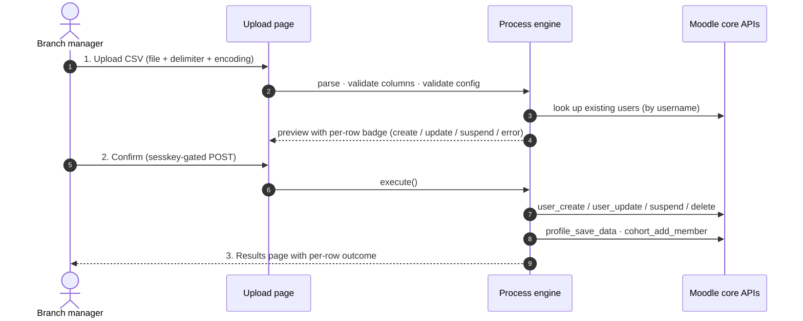

<!--
  README for local_branchupload — Moodle plugin by eLeDia GmbH, Berlin.
  Centre-aligned hero blocks use HTML because GitHub-flavoured Markdown
  does not have a native equivalent. Everything else is plain Markdown.
-->

<p align="center">
  <a href="https://eledia.de" title="eLeDia GmbH — eLearning im Dialog">
    
  </a>
</p>

<h1 align="center">Branch Office User Upload</h1>

<p align="center">
  <strong>Moodle plugin · <code>local_branchupload</code></strong>
  <br>
  <em>Delegate user provisioning to your branch offices via a guarded, branch-locked CSV upload —<br>
  without handing out site-administrator rights.</em>
</p>

<p align="center">
  <a href="https://github.com/eledia/moodle-local_branchupload/actions/workflows/moodle-ci.yml"></a>
  <a href="https://moodle.org"></a>
  <a href="https://www.php.net"></a>
  
  <a href="ACCESSIBILITY.md"></a>
  
  <a href="LICENSE"></a>
</p>

<p align="center">
  <a href="#-quick-start">Quick start</a> ·
  <a href="#-features">Features</a> ·
  <a href="#-csv-format">CSV format</a> ·
  <a href="#-security-model">Security</a> ·
  <a href="#-user-manuals">User manuals</a> ·
  <a href="#-development">Development</a> ·
  <a href="https://eledia.de"><strong>eledia.de</strong></a>
</p>

---

## ✨ At a glance

`local_branchupload` lets each *branch* — a **Behörde**, **Außenstelle**, school,
subsidiary, training location or SaaS tenant — maintain its own user list via a
plain CSV upload. Every uploader is automatically locked to their own branch
(determined by a custom profile field on their own account), so cross-branch
tampering is impossible by design. Site administrators bypass the lock and can
upload for any branch.

> Built for the **Landkreis Ravensburg** multi-municipality Moodle, generic
> enough for any organisation with delegated, branch-scoped user administration.

---

## 🚀 Quick start

```bash
# 1. Drop the plugin into your Moodle install (Moodle 5.x with public/ root):
git clone https://github.com/eledia/moodle-local_branchupload.git \
  path/to/moodle/public/local/branchupload

# 2. Trigger the install:
php path/to/moodle/admin/cli/upgrade.php --non-interactive
```

Then, as a site administrator:

1. **Create two custom user profile fields** — recommended shortnames
   `branchoffice` and `orgunit`.
2. **Create one cohort per branch** — the cohort `idnumber` is the value users
   carry in their `branchoffice` profile field (e.g. `GmndAchbrg`).
3. **Configure the plugin** under *Site administration → Plugins → Local
   plugins → Branch office user upload* — wire the two profile fields and
   pick the *Suspend* or *Delete* removal action.
4. **Grant `local/branchupload:upload`** to a *Branch manager* system role and
   assign it to one user per branch. **Set each uploader's own `branchoffice`
   profile field** to their branch's cohort `idnumber`.

That's it — branch managers now find the *Upload branch users* link in the
navigation drawer, on their profile page, and in *Site administration*.

> Full step-by-step walk-throughs for both administrators and branch managers
> live in the [user manuals](#-user-manuals) (DE + EN, Markdown + branded PDF).

---

## 🧩 Features

|  | |
|---|---|
| 📥 | **Three-step workflow** — Upload → colour-coded Preview → Confirm |
| 🔐 | **Branch enforcement** — non-admins can only touch users in their own branch |
| 👥 | **Automatic cohort assignment** — every user joins the cohort matching their branch |
| ➕ | **Additional cohorts** — pipe-separated extras per row (`SchulungA\|SchulungB`) |
| ♻️ | **E-mail change support** — match by old address via the *OldEmail* column |
| ⏸️ | **Suspend or delete** — admin decides what `Remove=1` actually does |
| 🤖 | **Auto-create cohorts** — optional, useful during initial roll-out |
| ✉️ | **Standard Moodle credentials e-mail** — new users receive login details via cron |
| 🛡️ | **No data at rest** — CSVs are processed in memory and discarded |
| 🌐 | **Configurable CSV column headers** — English canonical keys, site-language defaults, fully renamable |
| 🌍 | **Bilingual UI** — German (primary) and English |
| ♿ | **WCAG 2.2 Level AA** — formal conformance report shipped |
| 🧪 | **PHPUnit + Behat** — 27 unit tests, 7 acceptance features, CI-enforced |
| 🔒 | **Hardened CI** — Moodle Plugin CI + Semgrep SAST + Trivy + PHPDepend metrics |

## 🧭 How it works



The engine is one class — [classes/process.php](classes/process.php) — built
around Moodle's `csv_import_reader`. Column-header configuration is resolved
by a small dedicated helper, [classes/column_config.php](classes/column_config.php),
so a single rename in the admin settings is reflected everywhere (upload-form
hint, example-CSV download, preview/results table titles, validation error
messages).

## 🗂 Moodle compatibility

| Component | Version |
|-----------|---------|
| Moodle    | **4.5 (build 2024100700) and newer**, including 5.x |
| PHP       | **8.1, 8.2, 8.3, 8.4** |
| Databases | MariaDB / MySQL, PostgreSQL (covered by the CI matrix) |

CI runs against the most recent stable Moodle LTS plus the latest stable.

---

## ⚙️ Configuration

The plugin needs **two custom user profile fields** before it can be used.
Create them at *Site administration → Users → Accounts → User profile fields*.

| Profile field | Recommended shortname | Purpose |
|---------------|----------------------:|---------|
| **Branch / Behörde** | `branchoffice` | Identifies which branch a user (and the uploader) belongs to |
| **Organisational unit** | `orgunit` | Stores the per-user organisational unit from the CSV |

Then open the plugin settings and configure:

| Setting | Default | Description |
|---------|--------:|-------------|
| **Branch profile field** | *(none)* | The profile field that identifies a user's branch |
| **Organisational unit profile field** | *(none)* | Where the CSV `OrgUnit` / `Organisationseinheit` value is stored |
| **Auto-create cohorts** | off | Auto-create cohorts referenced in the CSV but missing |
| **Delete action** | `suspend` | What `Remove=1` does — suspend (reversible) or delete |
| **Maximum users per upload** | `500` | Per-CSV row cap; `0` disables the limit |

<details>
<summary><strong>CSV column headers</strong> — every header is configurable (click to expand)</summary>

The *CSV column headers* section in the plugin settings lets you rename every
column header that the plugin expects in the uploaded CSV. The **canonical
keys are English and stable across releases**; the **default header values
depend on the site language** (`$CFG->lang`), so a German site keeps the
historical `Behörde / Organisationseinheit / Löschen / Kohorten / Alte_Email`
vocabulary while an English site sees `Branch / OrgUnit / Remove / Cohorts /
OldEmail`.

| Setting | Required? | Default (`lang=en`) | Default (`lang=de`) |
|---------|:---------:|---------------------|---------------------|
| `local_branchupload/col_email`     | yes | `Email`     | `Email`                 |
| `local_branchupload/col_branch`    | yes | `Branch`    | `Behörde`               |
| `local_branchupload/col_orgunit`   | yes | `OrgUnit`   | `Organisationseinheit`  |
| `local_branchupload/col_lastname`  | yes | `LastName`  | `Name`                  |
| `local_branchupload/col_firstname` | yes | `FirstName` | `Vorname`               |
| `local_branchupload/col_remove`    | no  | `Remove`    | `Löschen`               |
| `local_branchupload/col_cohorts`   | no  | `Cohorts`   | `Kohorten`              |
| `local_branchupload/col_oldemail`  | no  | `OldEmail`  | `Alte_Email`            |

Header matching is **case-insensitive** and **trim-insensitive**, so
`emailaddress`, `EmailAddress` and `  EmailAddress  ` all resolve to the same
configured column. Renamed headers are propagated automatically to the
required/optional columns hint, the example-CSV download, the preview/results
table titles, and the validation error message when a column is missing.

> **Upgrading from 1.3.0?** `db/upgrade.php` migrates existing overrides from
> the old German config keys (`col_behoerde`, `col_orgeinheit`, `col_name`,
> `col_vorname`, `col_loeschen`, `col_kohorten`, `col_alte_email`) to their
> new English equivalents during the standard Moodle upgrade — no manual
> action required.

</details>

Finally, **create one cohort per branch**. The cohort `idnumber` must match
the value users carry in the `branchoffice` profile field (e.g. `GmndAchbrg`).

## 🔑 Capabilities

The plugin defines **one** capability:

| Capability | Type | Risks | Default archetype |
|------------|------|-------|-------------------|
| `local/branchupload:upload` | `write` | `RISK_SPAM`, `RISK_PERSONAL` | *(none — must be explicitly granted)* |

Recommended setup: create a system-level role *Branch manager*
(*Außenstellen-Verwalter*) that owns only this capability, then assign that
role to each branch office representative via *Site administration → Users →
Permissions → Assign system roles*. Each uploader must also have their own
`branchoffice` profile field set to the branch they manage; otherwise the
plugin refuses the upload with an explicit error message.

---

## 📋 CSV format

The example below uses the **default English headers** (i.e. an English
Moodle site). On a German site the defaults are
`Email;Behörde;Organisationseinheit;Name;Vorname;Löschen;Kohorten;Alte_Email`,
and the same example with German headers ships in the downloadable example
file on the upload page itself. Either way the column headers are
[renamable](#%EF%B8%8F-configuration).

**Required columns** (default English headers)

| Column | Description | Example |
|--------|-------------|---------|
| `Email` | E-mail (also used as the username) | `max.mustermann@example.de` |
| `Branch` | Branch identifier — must match a cohort `idnumber` | `GmndAchbrg` |
| `OrgUnit` | Stored in the configured profile field | `Bauverwaltung` |
| `LastName` | Last name | `Mustermann` |
| `FirstName` | First name | `Max` |

**Optional columns**

| Column | Description | Accepted values |
|--------|-------------|-----------------|
| `Remove` | Mark user for removal | `1`, `ja`, `yes`, `true` — empty otherwise |
| `Cohorts` | Additional cohort assignments | Pipe-separated cohort `idnumber`s |
| `OldEmail` | Previous e-mail when renaming a user | A valid e-mail of the existing account |

**Example**

```csv
Email;Branch;OrgUnit;LastName;FirstName;Remove;Cohorts;OldEmail
max.mustermann@example.de;GmndAchbrg;Bauverwaltung;Mustermann;Max;;SchulungA;
erika.neu@example.de;GmndAchbrg;Finanzen;Musterfrau;Erika;;SchulungA|SchulungB;erika.musterfrau@example.de
hans.beispiel@example.de;GmndAchbrg;Ordnungsamt;Beispiel;Hans;1;;
```

The downloadable example file on the upload page is generated on the fly
from the configured column headers, so renaming a header in the plugin
settings — or simply switching the site language — automatically updates
what the example download contains.

---

## 🛡 Security model

| Boundary | Enforcement |
|----------|-------------|
| Access to the upload UI | `local/branchupload:upload` capability at system context |
| CSV form submission | Moodle forms API + sesskey via `require_sesskey()` on step 3 |
| Cross-branch user **creation** | Row `Branch` must equal the uploader's profile-field value (admins exempt) |
| Cross-branch user **update** | Existing user's branch must equal the uploader's branch (admins exempt) |
| Branch-cohort smuggling via the *Cohorts* column | Refused if the cohort `idnumber` is a known branch value (admins exempt) |
| Existing user with an **empty** branch value | First non-admin uploader takes ownership — by design, so newly imported legacy users land in the uploader's branch |
| Example file download | Same capability check as the upload page |
| Upload size | 5 MiB cap by default (configurable via `$CFG->maxbytes`) |
| File contents | Validated by Moodle's `csv_import_reader`; column whitelist; per-cell `clean_param` / `validate_email` |
| Error disclosure | Internal exceptions are logged via `debugging(DEBUG_DEVELOPER)`; UI shows generic message |
| SQL | All access via Moodle's `$DB` API with named parameters; no raw SQL on TEXT columns |

### Continuous security

Every push and pull request runs four security-relevant gates on top of the
standard Moodle Plugin CI suite — see
[.github/workflows/moodle-ci.yml](.github/workflows/moodle-ci.yml):

- 🔬 **Semgrep SAST** — rulesets `p/php`, `p/security-audit`, `p/owasp-top-ten`, `p/secrets`; SARIF uploaded to the GitHub *Security → Code scanning* tab
- 📦 **Trivy** filesystem / dependency / secret scan (CRITICAL · HIGH · MEDIUM); SARIF uploaded; table-format summary in the job log
- 📊 **PHPDepend** code-quality metrics with a Markdown summary in every workflow run and SVG charts archived as artefacts
- ✅ **Moodle Code Checker** at `--max-warnings 0`

Full disclosure policy: [SECURITY.md](SECURITY.md).

## 🛂 Privacy / GDPR

The plugin is a **null privacy provider** — it stores no personal data of its
own. All user data flows through Moodle core APIs
(`user_create_user`, `user_update_user`, `delete_user`, `profile_save_data`,
`cohort_add_member`), which are themselves Privacy-API compliant. Uploaded
CSV files are processed in memory by `csv_import_reader` and purged after
processing (`$cir->cleanup()`); nothing is written to permanent file storage.

See [classes/privacy/provider.php](classes/privacy/provider.php) for the
`null_provider` implementation.

## ♿ Accessibility

The plugin conforms to **WCAG 2.2 Level AA**, including all five new
success criteria introduced in WCAG 2.2. The complete per-criterion
conformance protocol — with evidence, rationale, test methodology and known
theme-dependent limitations — lives in
**[ACCESSIBILITY.md](ACCESSIBILITY.md)**.

Highlights:

- Semantic `<ol>`-based step indicator with `aria-current="step"`
- All decorative icons `aria-hidden="true"`; meaningful icons paired with text
- Status conveyed by **three** redundant cues (colour + icon + text)
- Row-number cells use `<th scope="row">` for screen-reader row headers
- Drag-and-drop file upload has a native *Choose a file* button alternative
- All interactive targets meet the 24 × 24 CSS px WCAG 2.2 minimum
- Fully bilingual (DE / EN), no untranslated UI strings

---

## 📚 User manuals

Step-by-step walk-throughs for administrators **and** branch managers, in
both languages, with branded PDFs styled in the eLeDia corporate identity:

| | Markdown | PDF |
|---|---|---|
| 🇬🇧 **English** | [docs/user-manual/UserManual.md](docs/user-manual/UserManual.md) | [UserManual.pdf](docs/user-manual/UserManual.pdf) |
| 🇩🇪 **Deutsch** | [docs/user-manual/Benutzerhandbuch.md](docs/user-manual/Benutzerhandbuch.md) | [Benutzerhandbuch.pdf](docs/user-manual/Benutzerhandbuch.pdf) |

PDFs are generated by [docs/user-manual/build-pdf.sh](docs/user-manual/build-pdf.sh)
(pandoc → WeasyPrint pipeline) and live alongside the Markdown sources.

---

## 🧪 Development

<details>
<summary><strong>Local setup</strong></summary>

```bash
# 1. Get a Moodle dev env (e.g. via moodle-docker, or your existing install).
# 2. Symlink the plugin into the Moodle source:
ln -s /path/to/moodle-local_branchupload /path/to/moodle/public/local/branchupload

# 3. Run the install:
php admin/cli/upgrade.php --non-interactive

# 4. Purge caches after editing PHP/templates:
php admin/cli/purge_caches.php
```

</details>

<details>
<summary><strong>Coding standards & static checks</strong></summary>

The plugin targets the
[Moodle coding style](https://moodledev.io/general/development/policies/codingstyle):

```bash
# Install moodle-plugin-ci once:
composer create-project -n --no-dev --prefer-dist moodlehq/moodle-plugin-ci ci ^4
export PATH="$(pwd)/ci/bin:$(pwd)/ci/vendor/bin:$PATH"

# Then run any of:
moodle-plugin-ci phplint
moodle-plugin-ci codechecker
moodle-plugin-ci phpdoc
moodle-plugin-ci validate
moodle-plugin-ci mustache
moodle-plugin-ci grunt
```

</details>

<details>
<summary><strong>PHPUnit</strong></summary>

```bash
# From the Moodle root:
php admin/tool/phpunit/cli/init.php
vendor/bin/phpunit public/local/branchupload/tests/process_test.php
```

The suite covers user creation, updates, suspend vs delete, multi-cohort
assignment, auto-create on/off, branch mismatch, cross-branch update
rejection, branch-cohort smuggling, admin bypass, e-mail change via
*OldEmail*, e-mail conflicts, empty body, invalid e-mail format, max-upload
enforcement, configuration validation and the full English-canonical /
site-language-defaults column-header matrix.

</details>

<details>
<summary><strong>Behat</strong></summary>

```bash
# One-time init (from the Moodle root):
php admin/tool/behat/cli/init.php

# Then run only this plugin's scenarios:
vendor/bin/behat \
  --config $CFG_behat_dataroot/behatrun/behat/behat.yml \
  --tags=@local_branchupload
```

| Feature | Asserts |
|---------|---------|
| [access.feature](tests/behat/access.feature) | Capability gating |
| [upload_happy_path.feature](tests/behat/upload_happy_path.feature) | Three-step flow |
| [branch_enforcement.feature](tests/behat/branch_enforcement.feature) | Cross-branch + smuggling rejection |
| [delete_action.feature](tests/behat/delete_action.feature) | Suspend / delete switch |
| [form_validation.feature](tests/behat/form_validation.feature) | Required-file, e-mail format, max-rows |
| [custom_columns.feature](tests/behat/custom_columns.feature) | End-to-end column rename |
| [accessibility.feature](tests/behat/accessibility.feature) | WCAG 2.2 AA regression |

The scenarios use only stock Moodle Behat data generators plus one tiny
custom step (`Given the branchupload plugin is fully configured`) defined
in [tests/behat/behat_local_branchupload.php](tests/behat/behat_local_branchupload.php),
which seeds the required profile fields, plugin config and *Branch manager*
role in a single line so feature files stay readable as specifications.

</details>

### Continuous integration

GitHub Actions runs the full Moodle Plugin CI suite on every push and pull
request against a matrix of PHP 8.2 / 8.3 / 8.4 × PostgreSQL / MariaDB ×
`MOODLE_501_STABLE`, followed by the Semgrep / Trivy / PHPDepend gates
described in [Security model](#-security-model). See
[.github/workflows/moodle-ci.yml](.github/workflows/moodle-ci.yml).

---

## ⚠️ Known limitations

- The branch profile field's value space is read by enumerating all rows of
  `user_info_data` for that field; for installations with > 100 k users this
  may become a noticeable startup cost on the upload page. Cache TTL is
  per-request only.
- Password rotation is delegated entirely to Moodle's standard
  `create_password` mechanism — the plugin neither displays nor stores
  passwords.
- Only the **manual** auth method is used for newly created users.
- The plugin does not currently expose a web service / external API; CSV
  upload via the UI is the only supported workflow.

---

## 🤝 Contributing

Pull requests, issues and security reports are very welcome. Please read
[CONTRIBUTING.md](CONTRIBUTING.md) for branching, commit-message convention
and CI expectations, and [SECURITY.md](SECURITY.md) for the private
vulnerability-disclosure process.

## 📜 License

GPL v3 or later — see [LICENSE](LICENSE) for the full text.

---

<p align="center">
  <a href="https://eledia.de" title="eLeDia GmbH — eLearning im Dialog">
    
  </a>
  <br><br>
  <strong>eLeDia GmbH</strong> · <em>eLearning im Dialog</em><br>
  Wilhelmsaue 37 · 10713 Berlin · Germany<br>
  <a href="tel:+4930505610700">+49 30 5056 10-70</a> ·
  <a href="mailto:info@eledia.de">info@eledia.de</a> ·
  <a href="https://eledia.de">eledia.de</a><br>
  <sub>Moodle Premium Partner · ISO/IEC 27001 certified · Moodle Global Partner of the Year 2025</sub>
</p>

<p align="center">
  <sub>© 2026 eLeDia GmbH, Berlin · Released under the GNU GPL v3 or later · Built with ❤️ in Berlin</sub>
</p>
